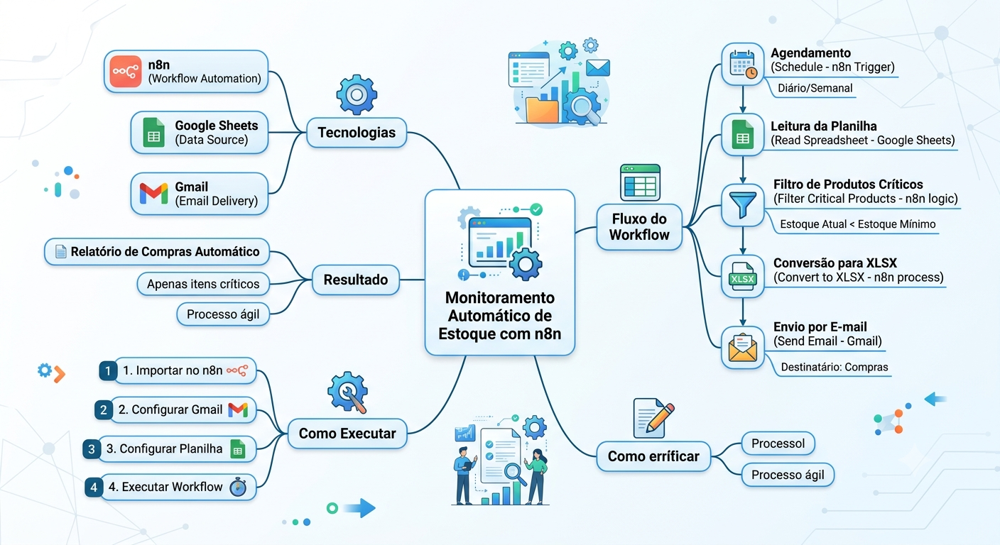
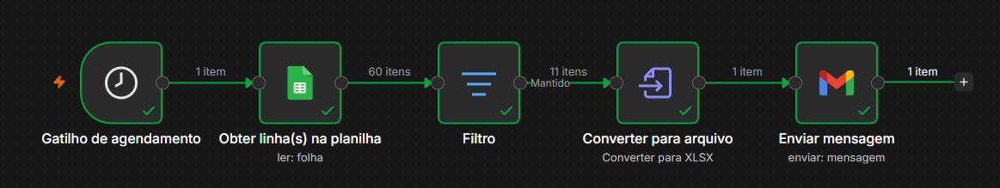
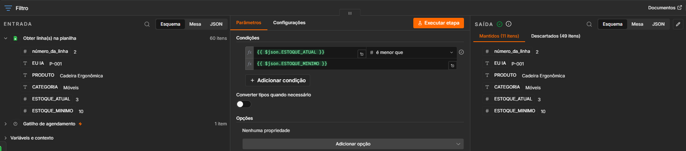
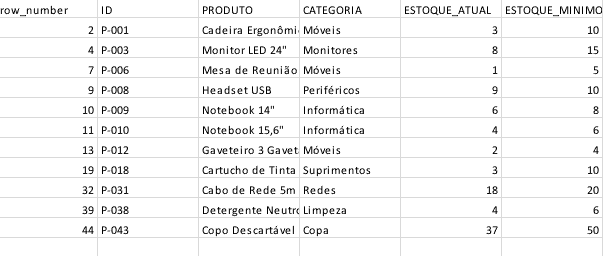
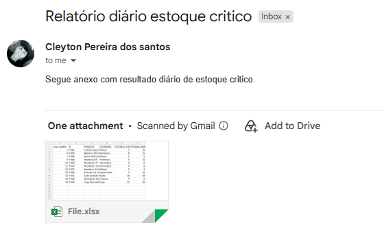

# 📦 Monitoramento Automático de Estoque com n8n

## 📖 Sobre o projeto

Este projeto automatiza o monitoramento de estoque de uma empresa.

Todos os dias, o workflow consulta uma planilha contendo o estoque atual dos produtos, identifica quais itens estão abaixo do estoque mínimo e envia automaticamente um relatório em Excel para o setor de compras.

O objetivo é eliminar a conferência manual da planilha e agilizar o processo de reposição de estoque.

---

## 🚀 Tecnologias utilizadas

- n8n
- Google Sheets
- Gmail
- XLSX

---

## ⚙️ Fluxo da automação

```text
Agendamento Diário
        │
        ▼
Leitura da Planilha
        │
        ▼
Comparação:
Estoque Atual x Estoque Mínimo
        │
        ▼
Filtro dos Produtos Críticos
        │
        ▼
Geração do Arquivo XLSX
        │
        ▼
Envio Automático por E-mail
```

---

## ✅ Problema resolvido

### Antes da automação

- Conferência manual da planilha
- Filtragem manual dos produtos
- Criação manual do relatório
- Envio manual do e-mail

### Depois da automação

- Processo automatizado
- Redução de tarefas manuais
- Menor risco de erros no processo
- Economia de tempo
- Comunicação rápida com o setor de compras

---

## 📂 Estrutura do projeto

```text
📦 automacao_estoque_n8n
│
├── Automação Estoque Critico.json
│
├── imagens/
│   ├── mapa_mental.png
│   ├── fluxo_processo.png
│   ├── Fiiltro.png
│   ├── email_enviado.png
│   └── saida_estoque.png
│
└── dados/
    └── estoque_exemplo.xlsx
```

---

## 📄 Workflow da automação

O workflow completo da automação está disponível no arquivo:

`Automação Estoque Critico.json`

O fluxo foi desenvolvido no n8n e contempla as seguintes etapas:

- Gatilho de agendamento
- Leitura dos dados no Google Sheets
- Identificação dos produtos com estoque abaixo do mínimo
- Filtragem dos produtos críticos
- Conversão dos dados para arquivo XLSX
- Envio automático do relatório por e-mail

---

## ▶️ Como executar

1. Faça o download do arquivo `Automação Estoque Critico.json`.
2. Importe o workflow no n8n.
3. Configure as credenciais do Google Sheets.
4. Configure as credenciais do Gmail.
5. Configure a planilha utilizada como fonte de dados.
6. Execute o workflow manualmente ou configure o agendamento automático.

> **Observação:** As credenciais e configurações de acesso utilizadas no projeto não são disponibilizadas no repositório por questões de segurança.

---

## 💡 Possíveis melhorias

Como evolução futura do projeto, podem ser implementadas novas funcionalidades, como:

- Integração com banco de dados SQL
- Dashboard de acompanhamento no Power BI
- Notificações via Microsoft Teams
- Notificações via Slack
- Integração com WhatsApp
- Utilização de IA para gerar um resumo dos produtos críticos
- Registro histórico das ocorrências de estoque
- Classificação dos produtos por nível de urgência
- Geração automática de indicadores de estoque

---

## 🧠 Visuais da automação

### Mapa mental do processo



### Fluxo do processo



### Filtro dos produtos críticos



### Planilha de estoque



### Resultado do envio por e-mail



---

## 👨‍💻 Autor

**Cleyton Pereira dos Santos**

GitHub: https://github.com/DevCleyt
